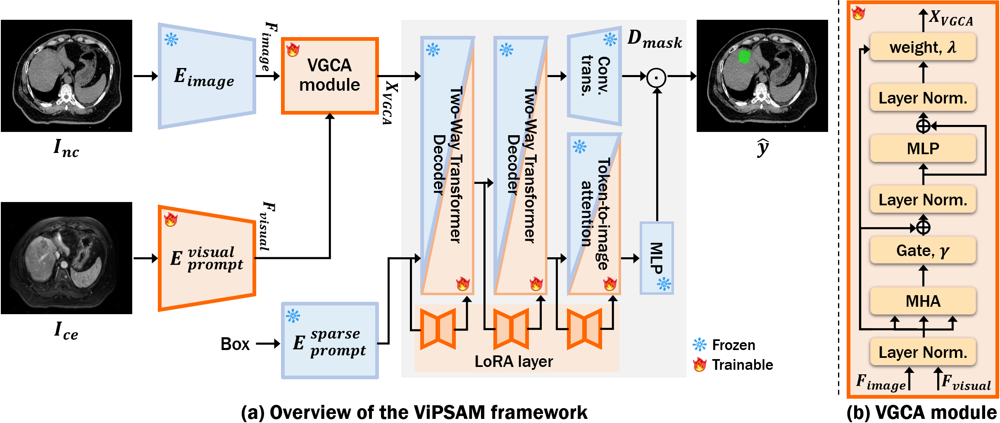

# ViPSAM : Visaul Prompting Medical Image Segmentation Using Segment Anything Model

The official source code for "ViPSAM: Visual Prompting Medical Image Segmentation Using Segment Anything Model".

# Implementation

A PyTorch implementation of a deep learning-based model.

- Requirements
  - OS : Ubuntu / Windows
  - Python 3.10.18
  - PyTorch 2.5.1

# Dataset

- In our experiments, we used a proton therapy planning dataset consisting of non-contrast CT and contrast-enhanced MRI scans collected at a tertiary medical center.

# Evaluation

- test.py is the implementation code if inference for liver lesion segmentation
